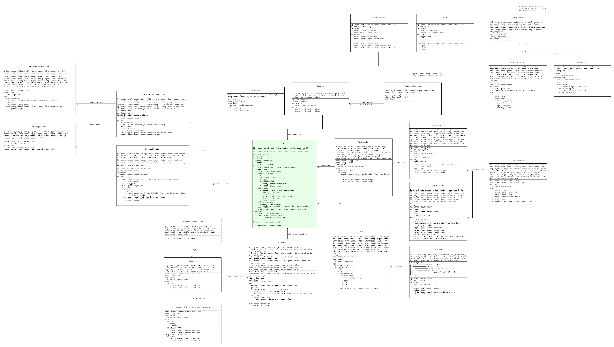

= k8-examples
:toc:

== About
Collection of stuff, templates, blueprints, and more I am using to learn and remember the k8 concepts.

== K8 Objects CheatSheet

== Apps

=== link:./api-gateway-app[api-gateway-app]
Simple application with a nginx k8 ingress controller setup.

=== link:./monitoring-app[monitoring-app]
Simple application for playing with RBAC access and the k8 api and some Prometheus.

=== link:./netpol-app[mqtt-app]
Simple application for sending and receiving MQTT packages in an environment guarded by network policies.

=== link:./probes-app[probes-app]
Simple application for playing with readyness and liveness probes.